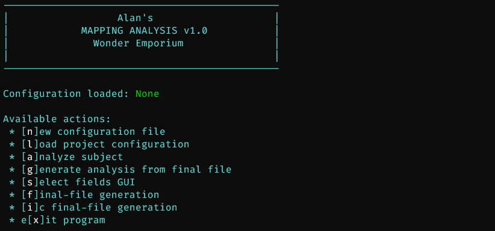
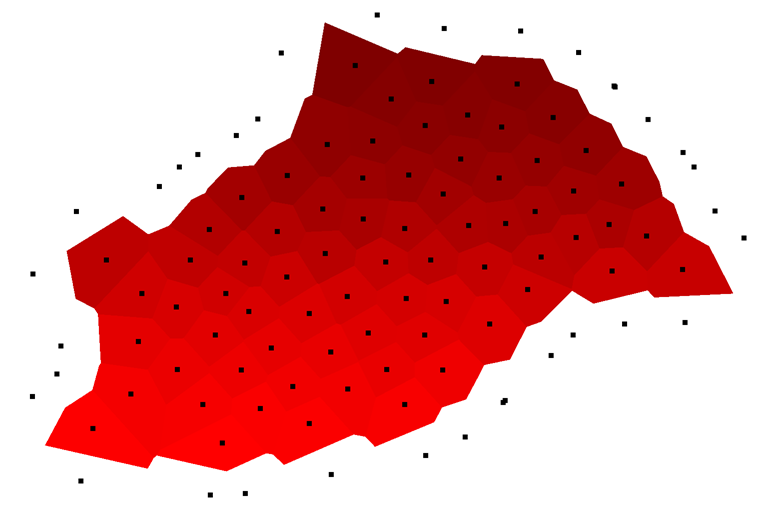
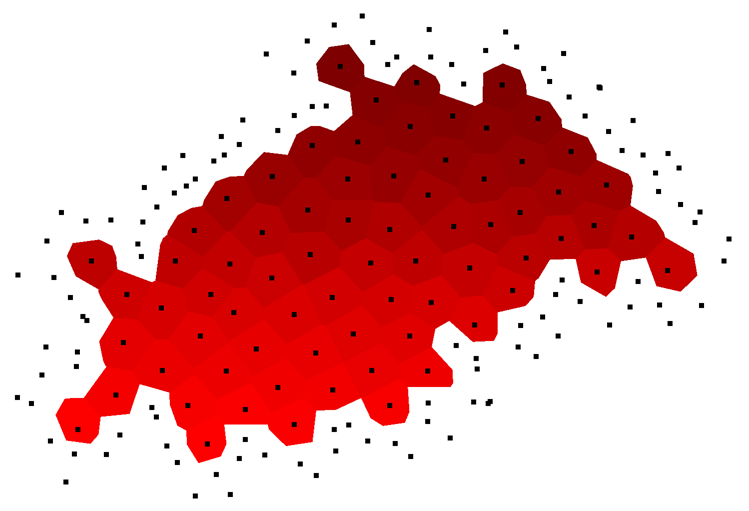
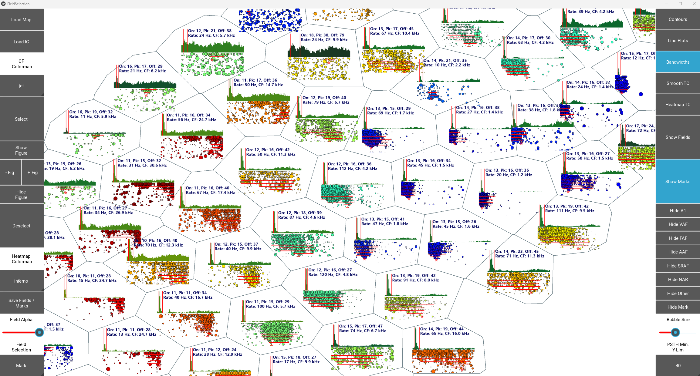
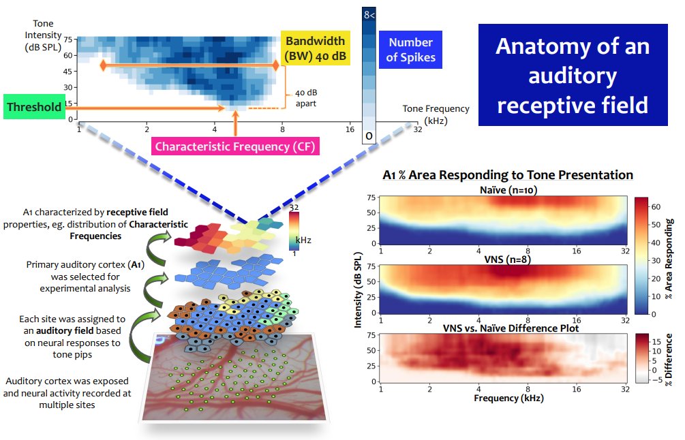
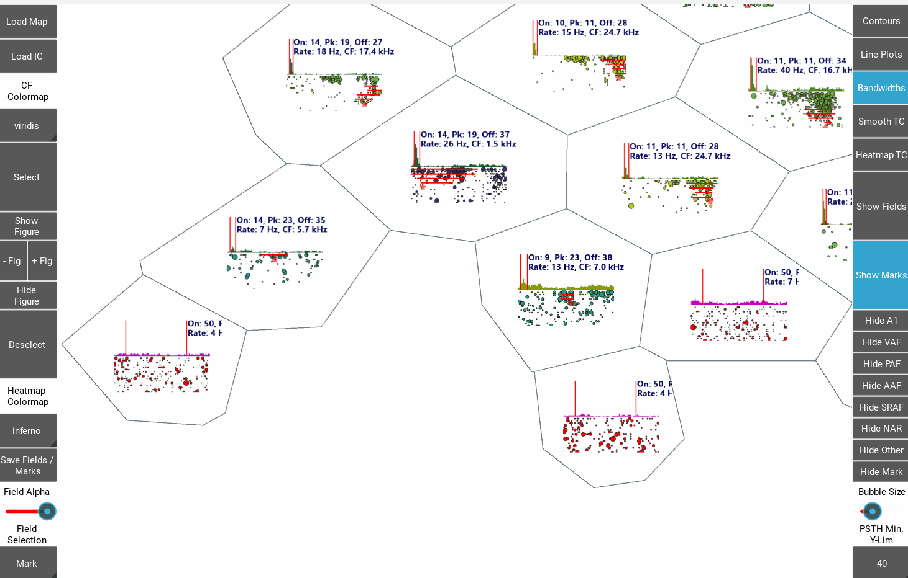
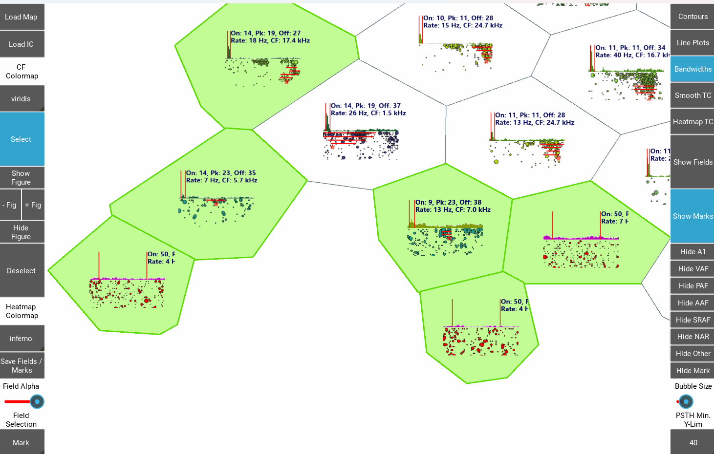

- [About](#about)
- [Setup](#setup)
  - [Anaconda (do this unless you know what you are doing without it)](#anaconda-do-this-unless-you-know-what-you-are-doing-without-it)
  - [Necessary software](#necessary-software)
    - [Tesseract](#tesseract)
    - [Special installs](#special-installs)
    - [Special note about Kivy](#special-note-about-kivy)
  - [(optional) Dadroit JSON viewer](#optional-dadroit-json-viewer)
- [Running program](#running-program)
  - [New configuration](#new-configuration)
  - [Load configuration](#load-configuration)
  - [Analyze subject](#analyze-subject)
    - [Filetype](#filetype)
    - [Electrode penetration x/y data](#electrode-penetration-xy-data)
    - [Voronoi tessellation](#voronoi-tessellation)
    - [Analysis](#analysis)
  - [Generate analysis from final file](#generate-analysis-from-final-file)
  - [Select fields GUI](#select-fields-gui)
  - [Final file generation](#final-file-generation)
  - [IC Final file generation](#ic-final-file-generation)
- [Selection GUI](#selection-gui)
- [The end](#the-end)

# About
Set of programs to analyze neural tuning curves and associated data from cortical and subcortical auditory regions of the rat brain.

A lot of lessons were learned in the process of creating this, don't judge too harshly 😄

It appears to have gotten slower over time as libraries have updated, and I don't know why. 
Also the Field Selection GUI doesn't close correctly any more for some reason. After CLI menu returns, just enter `x` option and it should eventually close.

# Setup
Uses Python version 3.9.x

## Anaconda (do this unless you know what you are doing without it)
Download/install Anaconda https://www.anaconda.com/, then use the `conda-env.yml` file in this repo to create a new environment for this program:
- `conda env create -f conda-env.yml -n <your-env-name>`

## Necessary software
### Tesseract
- Homepage: https://tesseract-ocr.github.io/tessdoc/Home.html
- Windows installer: https://github.com/UB-Mannheim/tesseract/wiki

Used for OCR of map images to create the beautiful voronoi plots with points and numbers all matched up.

Currently the path to the .exe **MUST** be given to python by the `map_analysis` program, and it is hardcoded to the default install location (which is highly recommended to leave as-is by tesseract Windows team anyway):
- `"C:/Program Files/Tesseract-OCR"`

After installing, you **MUST** copy `./resources/mapOCR.traineddata` from this repo to `"C:/Program Files/Tesseract-OCR/tessdata/"`. This is the training file that tells tesseract how to OCR our map numbers from associated image files. For the life of me I don't know why the non-specially-trained OCR engine struggles with what should be a simple job, but it does. This training file was a pain to create, but it works.

### Special installs
#### kivy-garden
Kivy has a special tool, `kivy-garden`, to distribute 3rd party Kivy packages.
`kivy-garden` was pip installed if you created a conda environment from `conda-env.yml` in this repo, and now we use it here to install a matplotlib support package for kivy.
https://kraisnet.de/index.php/en/topics/14-visualize-data-with-kivy/46-install-kivy-garden-matplotlib

At Anaconda prompt:
`garden install matplotlib`

Hopefully that works for you without error. I can't predict the future though. Good luck, cadet.

#### tinymongo_fix
Not an install, just a tweak to the [tinymongo](https://github.com/schapman1974/tinymongo) package after an update broke the thing. It's no longer a maintained package, but this program uses it, so.

Just leave the `tinymongo_fix` folder in the `src` dir, and if you ever feel like writing/changing code that uses it, do:

`from tinymongo_fix.tinymongo_fix import TinyMongoClient`

### Special note about Kivy
Kivy is a GUI framework for python. GUIs in python are hard. GUIs are hard in general, but in python they are very hard. This map program is an especially weird GUI. Most people making GUIs don't want/need to do what I did. Kivy was the only python GUI framework I found at the time of creation that allowed me to make a bunch of plots for mapping sites in a way that was functional.

But Kivy kind of sucks.

If you find yourself at all perplexed or else tempted to make a change or use an updated package, I understand. But probably, don't.

## (optional) Dadroit JSON viewer
https://dadroit.com/download
Simple tool to view json files as a tree structure like a file explorer. Helps to investigate any potential issues in the json database files -- these are typically too large to open (or at least open comfortably) in normal text editor programs.

There are many alternative JSON viewers. I like Dadroit.

# Running program
- Open Anaconda Prompt
- `conda activate map-analysis` or similar environment for the program. See Setup above.
- Navigate to `src/map_analysis.py`
- Run `python map_analysis.py` 

Should see a CLI menu pop-up (eventually; startup can be a little slow)

## New configuration
Running a new analysis requires the use of a configuration file so that the program knows how to handle your data. Enter `n` and follow the prompts.

## Load configuration
Enter `l` and select project configuration file.

A demo configuration file is included in `demo/demo_config.json`.

## Analyze subject 
Run auto-analysis for a subject using your loaded project configuration file. Creates a subject `json` file to store data and analysis together. Follow the prompts and have fun.
- NOTE: If you exit early or re-run a subject with the same dir name, the program will combine the outputs and create duplicates of raw data / analyses -- delete the old file first or save new file to different location.

A demo analysis can be run by loading `demo/demo_config.json` for the project configuration and using the files supplied in the rest of the `demo` dir (when prompted for subject name, enter anything you earnestly wish for).

### Filetype
Analysis from neurophysiological data expects `.src` or `.f32` filetypes.

If running demo analysis, select `s`.

### Electrode penetration x/y data
The program can load x/y coordinate data from images, "final files" (lab-specific option), or from a `.csv` file. The image option uses 3 `.png` images to find and extract map coordinates matched with their corresponding map numbers:
- A 'points' image marks electrode penetration sites; used for x/y coordinates
- A 'mask' image is used to indicate the bounding box locations of all map numbers. Proximity to coordinates from the points image matches each site with a map number.
- A 'numbers' image contains map numbers which are extracted using the mask image and then OCR'ed

Demo analysis uses images -- select `i`, then use `demo/img/pts.png`, `demo/img/num.png`, and `demo/img/msk.png` for points, numbers, and mask, respectively.

### Voronoi tessellation
In auditory cortical maps, each point on the cortical surface is assumed to have the characteristics of the closest sampled penetration. A voronoi tessellation is generated from the map electrode x/y data. To prevent outer edges extending to infinity, an initial set of border points is automatically generated around the perimeter of the map (and their corresponding polygons ignored):

Typically, additional border points need to be manually added to further constrain the shape of the outer polygons. The goal is to create as uniform an area around each point as possible (matching the relative size of inner polygons), such that each electrode penetration (black dots) represents a roughly equal sample of cortical area. While I find this shaping process fun, a simple pass constraining the most egregious outer borders is sufficient.

### Analysis
Finally, select the dir containing either the `.src` or `.f32` files for the subject.

The auto-analysis parses all relevant data for a project for a single subject, focused specifically on auditory tuning curve analysis (attempts to identify onset/offset latencies, characteristic frequencies, thresholds, and bandwidths 10-40 dB above threshold). This will take awhile. A single subject typically takes 20-60 minutes to finish, depending on the number of mapping sites collected. The majority of time is spent estimating onset latencies using a bayesian algorithm, because faster latency estimations are typically very brittle, too specific, and overall give poor results. A poor estimate of onset latency screws the rest of the auto-analysis and leads to more manual corrections and lower consistency between subjects/projects. Go get a coffee.

Outputs a subject `.json` file containing:
- Metadata
- Project config
- Raw data
- Analysis

Speech and noiseburst auto-analyses were planned but never yet included, so only raw data is collected into the subject `.json` file for these two stimulus types.

## Generate analysis from final file
Option specific to our lab for generating a subject analysis file for use with the "Select fields GUI" using a previous MATLAB format. Final file must be .xls file. Export `.mat` to `.xls` in MATLAB.
- Currently you cannot add a new final-file analysis to an existing subject database, you have to make a new one.

## Select fields GUI
GUI application to manually edit neurophysiological tuning curve analysis and select auditory cortical fields / responsive IC sites.

Currently you can only run the GUI once per run of `python map_analysis.py` -- just close and re-run to load a new subject. This is Kivy's fault, don't blame me (except that I chose to use Kivy).

The GUI can be brutally slow to load maps and save changes. Such is life. Go get a coffee. Every site in a map generates matplotlib figures. Will see `*** Ready! ***` in the command line when the plots are done generating. It may be necessary to zoom out (mouse wheel) in the GUI canvas to see the map initially.

There is no auto-save functionality. You have to save the file manually.

- NOTE: Hopefully never an issue again... BUT, there is a hard limit on the number of sites the GUI will load -- something like 208 sites. This is an issue with some limit set somewhere in some underlying graphics framework, far, far removed from here. There is nothing to be done about it.

For more detail about using the GUI, see [Selection GUI](#selection-gui) section.

## Final file generation
Generate a "final file" `xls` document from a subject's analysis data. Used by our lab for custom MATLAB scripts.

## IC Final file generation
Same as above, but for inferior colliculus data format. It is the fault of past individuals that this is a separate option. Accept your fate.

# Selection GUI
Displays all auditory map data for a subject in an interactable and navigable "canvas". Allows for manual analysis of tuning curves, adjustment of onset/offset latencies for marking driven neural responses, and categorization of sites into specific auditory cortical fields (e.g. A1, AAF, VAF, non-responsive, misc...).

If you've made it this far into this repo / readme and don't know what any of this is about, then examine this graphic below that I made for a presentation at some point in the past. I hope it makes sense. If it doesn't, it's probably your fault.

Basically, this program was made for analysis of rodent auditory cortical data. Electrodes are inserted into exposed cortical tissue, tones of various intensities and frequencies are played and neural activity recorded. Each electrode site is then categorized into auditory fields based on the driven neural response to all of the stimuli. Further analysis can then be performed, e.g. comparing responses of primary auditory cortex (A1) between experimental groups.

Pan/zoom around the GUI, double-click within a site to bring up a more detailed view, make any adjustments to tuning curve analysis, save and return to the map-wide view:

Sites can be "marked" to indicate that their analysis is acceptable (or for whatever reason you want). Select `Select` widget and paint with click+hold then drag:

"Marks" are displayed separately from auditory fields -- to select fields, switch "Mark" to a field option. Single-clicking within a site while `Select` is active can apply marks/fields to individual sites (in this example, a few border sites are identified as non-auditory responsive, or "NAR", characterized by a lack of auditory tuning and / or no driven response observable in the PSTH):

The goal of the GUI, beyond manually adjusting analysis as needed, is to make categorization of cortical neurophysiological recordings into auditory fields as easy as possible. Auditory fields have patterns of tuning and driven neural responses that are most apparent with a broad overview of multiple recordings at once. The most obvious of these in typical maps is the tonotopic organization of the characteristic frequency (CF) of tuning curves (the frequency at the "V" point of the tuning curve). Primary auditory cortex (A1) progresses from low-to-high frequencies as you move across the map, reversing in CF at the borders with other auditory fields. 

In the demo gif below, the colors of the bubble plots represent the site's CF, and can easily be seen to progress from low frequency CF's on the right-hand side of the canvas (dark blue) to high frequency CF's on the left-hand side (red). The borders of the cortical field can be seen on the top from poor tuning (disorganized bubble plots) and high spontnaeous activity relative to driven activity (PSTHs), and on the right from a reversal of CF. The bulk of the sites are quickly categorized as A1 using the `Select` tool, followed by categorizing a few of the border sites as another auditory field (here, VAF).

# The end
You are an expert now. Congratulations. Enjoy some cake.
