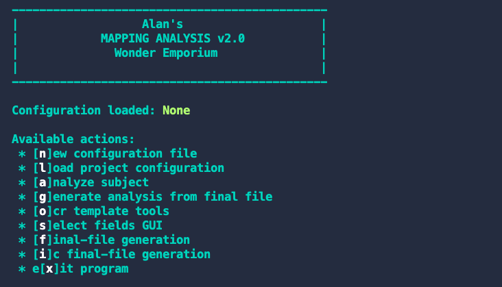
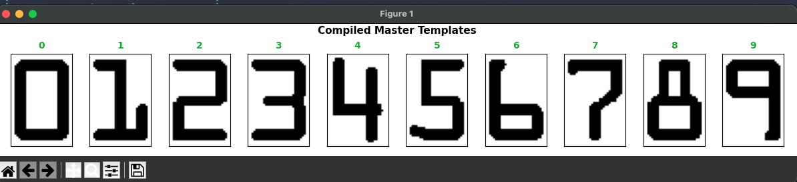
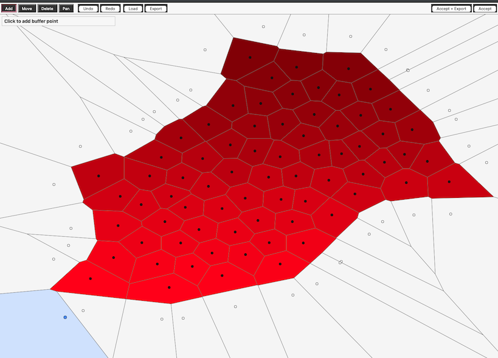
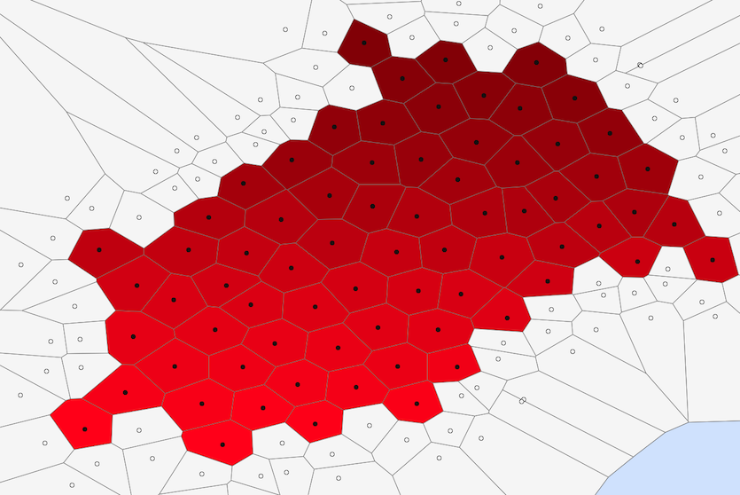
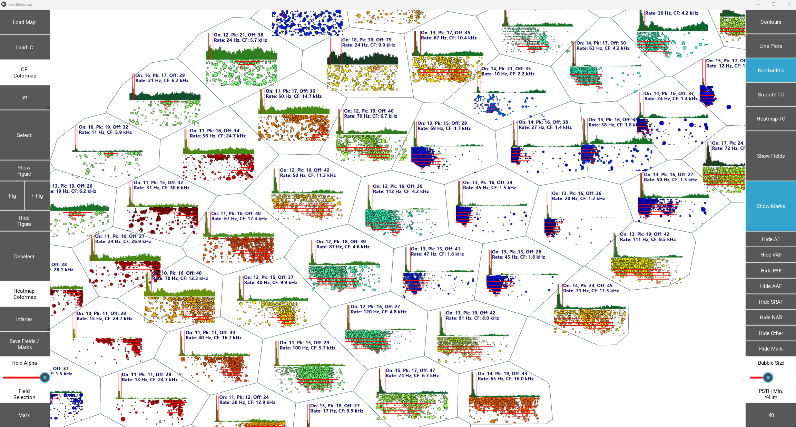
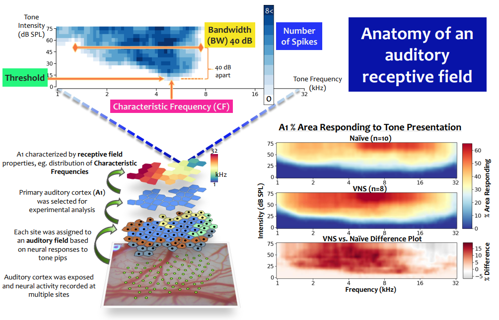
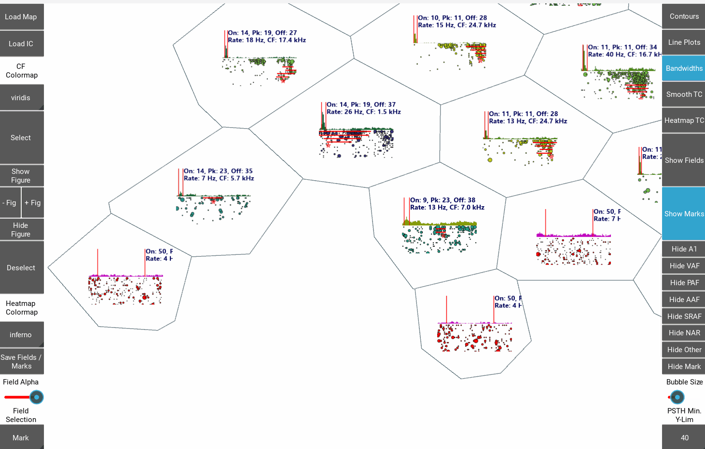
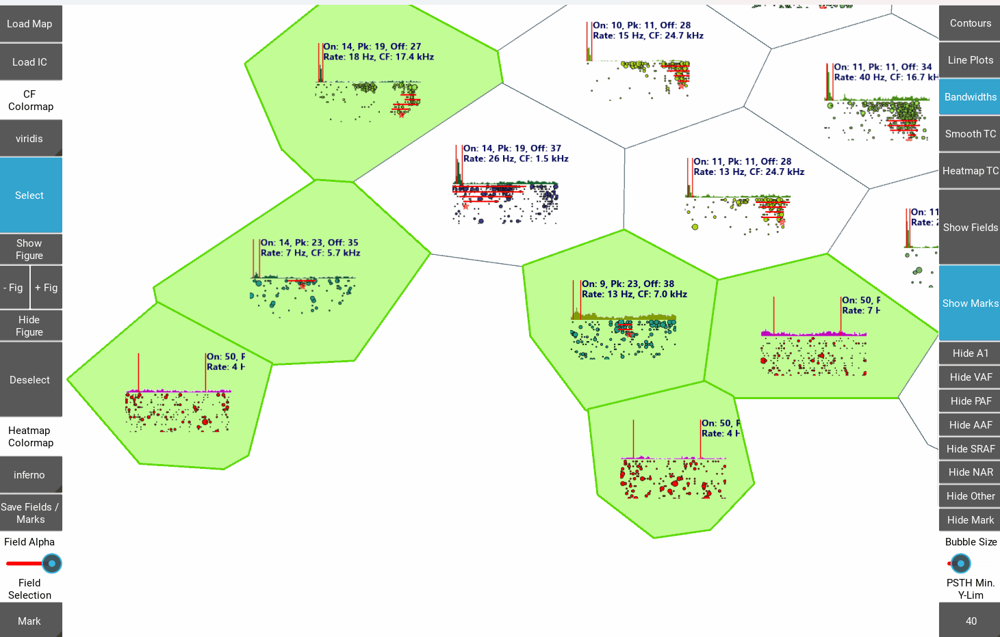

# Auditory Data Suite

CLI and GUI tools for analyzing auditory neural tuning curves plus the map data used to place those analyses in cortical or IC space.

- This is a research-workflow codebase with a lot of GUI and data-format opinions baked in.
- The GUI stack is a Tk + Matplotlib + Kivy arrangement, which means it is functional and also occasionally dramatic.

## Setup

Should support Python versions 3.10 through 3.12 (and potentially 3.13 and 3.14 as well).

- Clone the repo, create a new Python environment, and run from the checkout.
- `pip install -e .` inside that environment to install dependencies.

### Recommended install

The current recommended path is [uv](https://github.com/astral-sh/uv), since it can manage both Python and the project environment. From the cloned dir root:

```bash
uv python install 3.12
uv venv --python 3.12
source .venv/bin/activate
uv pip install -e .
```

### Standard-library fallback

If you already have Python `3.10+` installed and don't want another tool involved, it's still recommended to use a virtual env:

```bash
python -m venv .venv
source .venv/bin/activate
pip install -e .
```

### OCR resources

Derivation of map electrode numbers and their coordinates from images uses a built-in OCR templating workflow. Templates can either be built directly from font files, or else bootstrapped from a pair of map images (numbers + mask).

- The bundled fallback font lives at `resources/OCR-A.otf`.
- If `resources/digit_templates.npz` exists, that template set is preferred over the font.
- During analysis or preview, you can also browse to any `.npz`, `.ttf`, or `.otf` OCR template source manually.

### (optional) Dadroit JSON viewer
https://dadroit.com/download Simple tool to view JSON files as a tree structure like a file explorer. Helps to investigate any potential issues in the JSON database files -- these are typically too large to open (or at least open comfortably) in normal text editor programs.

There are many alternative JSON viewers. I like Dadroit.

## Running the program

From the cloned dir (or just with the virtual env activated a la `source .venv/bin/activate`), run either of the commands below:

```bash
# if you did `pip install -e .`
map-analysis

# or just direct python to the main entry point
python src/map_analysis.py
```

And you'll be greeted by a CLI menu like this:



## Main workflows

### OCR template tools

At the CLI, choose `o`.

Available actions:

- `b` bootstraps a new OCR template set from a numbers image plus matching mask image (useful if using a font unavailable as a standalone font file for some reason). Bootstrap output can go either to the default path `resources/digit_templates.npz` or to another `.npz` file of your choice.
- `p` previews an OCR source before analysis (saved `.npz` template, or `.otf`/`.ttf` font file).



### New project configuration

Running a new analysis requires the use of a configuration file so that the program knows how to handle your data. Enter `n` and follow the prompts.

### Load configuration

Enter `l` to load an existing project configuration file.

A demo configuration is included at `demo/demo_config.json`.

### Analyze a subject

At the CLI, choose `a` after loading a project configuration to run auto-analysis for a subject. Creates a subject JSON file to store data and analysis together. Follow the prompts and have fun.

What the workflow expects:

- Neural data files in `.src` or `.f32` BrainWare format.
- Electrode coordinate data from images, a lab-style final file, or a `.csv` (or a depths `.csv` if analyzing an IC map).
- Optional OCR source selection if image-based coordinates are used.

The image-based coordinate flow uses three grayscale `.png` images:

- A points image for penetration-site coordinates.
- A mask image for the bounding boxes of map numbers.
- A numbers image for the map-number glyphs themselves.

When image-based coordinates are selected:

- If `resources/digit_templates.npz` exists, it is offered as an OCR template source first.
- Otherwise `resources/OCR-A.otf` is offered.
- Or you can opt to browse and select another `.npz`, `.ttf`, or `.otf` file.

After OCR, the program shows a proof sheet of the recognized map numbers. You can optionally export the recognized coordinates to a `.csv` with `number,x,y` columns.

#### Demo

A demo analysis can be run by loading `demo/demo_config.json` for the project configuration and using the files supplied in the rest of the demo dir (when prompted for subject name, enter anything you earnestly wish for).

For the included demo, use:

- `demo/demo_config.json`
- `.src` file type
- `demo/img/demo_pts.png`
- `demo/img/demo_msk.png`
- `demo/img/demo_num.png`
- `demo/data/`

### Voronoi tessellation and boundary editing GUI

In auditory cortical maps, each point on the cortical surface is assumed to have the characteristics of the closest sampled penetration. A voronoi tessellation is generated from the map electrode x/y data. To prevent outer edges extending to infinity, an initial set of border points is automatically generated around the perimeter of the map (and their corresponding polygons ignored:



In most real datasets you will still want to add or trim a few border points manually to keep the outer polygons reasonably shaped.

**Voronoi Picker GUI Controls:**
- Interaction menu / toolbar: switch between Add, Move, Delete, and Pan modes
- A / M / D / P: keyboard shortcuts for those interaction modes
- Move and Delete modes: hover near a buffer point to target it with a ring
- Ctrl+Z / Ctrl+Shift+Z (or Ctrl+Y): undo and redo point edits
- Mouse wheel or View menu: zoom; Pan mode drags the view
- Export or Accept and Export: save reusable buffer-point CSV files
- Load: bring a saved buffer-point CSV back into the picker
- Esc / Accept / Close window: accept border points (no export)

Here's the same map with a little manual refinement on the border edges:



There is also a standalone demo harness if you just want to play around:

```bash
python demo/voronoi_picker_demo.py
python demo/voronoi_picker_demo.py path/to/coords.csv
python demo/voronoi_picker_demo.py path/to/coords.csv --buffer-points saved_buffer.csv
```

### Analysis outputs

Subject analysis writes a subject `.json` database containing:

- Metadata
- Project configuration
- Raw data
- Analysis results

DenseTC analysis is the main automated path. Speech and noiseburst definitions exist in the config/data model, but they currently just aggregate the raw data with its metadata.

### Generate analysis from a final file

At the CLI, choose `g`.
This is the lab-specific path for generating a subject analysis database from an existing final-file based `.xlsx` spreadsheet.

### Final-file export

At the CLI:

- `f` exports a cortical final-file spreadsheet.
- `i` exports the IC variant.

Both exports currently write `.xlsx` files.

### Select fields GUI

At the CLI, choose `s`. A follow-up prompt will ask if you want to load a cortical (option `c`) or IC map (option `i`).

The GUI is used to manually inspect and edit DenseTC analyses, assign cortical fields, and work with IC map analyses.

GUI notes:

- Rendering "smooth TCs" can take a while the first time (subsequent renders use cached TC)
- Unsaved GUI edits are backed up to a sidecar `.autosave` file next to
  the subject database and can be recovered on the next load.

## GUI overview

The field-selection GUI shows a full map at once in an interactable and navigable canvas, so you can inspect tuning curves, PSTHs, field assignments, and manual edits in context.



If you've made it this far into this repo / readme and don't know what any of this is about, then examine this graphic below that I made for a presentation at some point in the past. This program was made for analysis of rodent auditory cortical data. Electrodes are inserted into exposed cortical tissue, tones of various intensities and frequencies are played and neural activity recorded. Each electrode site is then grouped into auditory fields based on tuning and response structure. Further bespoke analysis can then be performed, e.g. comparing responses of primary auditory cortex (A1) between experimental groups.



Pan and zoom the map, double-click a site to open the detailed view, adjust analysis values, then save and return:


Sites can be "marked" to indicate that their analysis is acceptable (or for whatever reason you want). Toggle the `Select` widget and paint with `click+hold`, then drag:



"Marks" are displayed separately from auditory fields. To select fields, switch "Mark" to a field option. Single-clicking within a site while `Select` is active can apply marks/fields to individual sites (in this example, a few border sites are identified as non-auditory responsive, or "NAR", characterized by a lack of auditory tuning and / or no driven response observable in the PSTH):



The goal of the GUI, beyond manually adjusting analysis as needed, is to make categorization of cortical neurophysiological recordings into auditory fields as easy as possible. Auditory fields have patterns of tuning and driven neural responses that are most apparent with a broad overview of multiple recordings at once. The most obvious of these in typical maps is the tonotopic organization of the characteristic frequency (CF) of tuning curves (the frequency at the "V" point of the tuning curve). Primary auditory cortex (A1) progresses from low-to-high frequencies as you move across the map, reversing in CF at the borders with other auditory fields.

In the demo GIF below, the colors of the bubble plots represent the site's CF, and can easily be seen to progress from low frequency CF's on the right-hand side of the canvas (dark blue) to high frequency CF's on the left-hand side (red). The borders of the cortical field can be seen on the top from poor tuning (disorganized bubble plots) and high spontnaeous activity relative to driven activity (PSTHs), and on the right from a reversal of CF. The bulk of the sites are quickly categorized as A1 using the `Select` tool, followed by categorizing a few of the border sites as another auditory field (here, VAF).


# The end

You are an expert now. Congratulations. Enjoy some cake.
